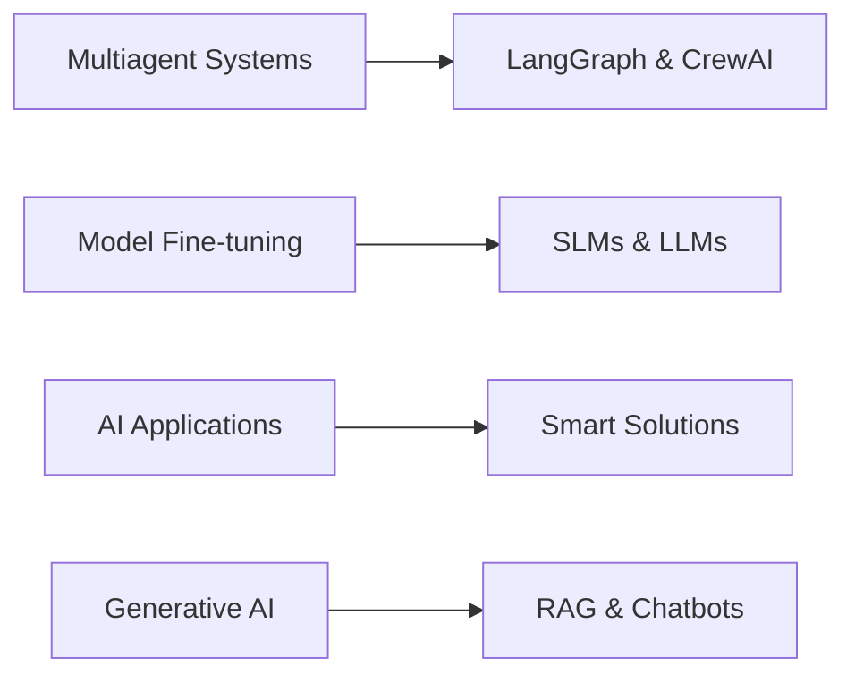

# 👋 Hi there! I'm Shikhar Aryan

<div align="center">
  
  
  [](https://www.linkedin.com/in/shikhar-aryan-6aa98a1b4/)
  [](https://www.kaggle.com/shikhararyan)
  [](mailto:Shikhararyan0@gmail.com)
  
</div>

---

## 🚀 About Me

> **AI/ML Developer** passionate about transforming data into intelligent solutions

I'm an experienced AI/ML Developer with expertise in building multiagent systems, fine-tuning language models, and creating innovative applications. Currently working at **letsAI Solutions**, I focus on leveraging the potential of LLMs to develop smart, solution-oriented applications.

📍 **Location:** Indirapuram, Ghaziabad, 201014  
📧 **Email:** [Shikhararyan0@gmail.com](mailto:Shikhararyan0@gmail.com)

---

## 🎯 Current Focus



---

## 🎓 Education

<table>
<tr>
<td>
  
**🏛️ Bachelor of Technology in Information Technology**  
*JSS Academy of Technical Education, U.P.*  
📅 Aug 2019 – May 2023

</td>
</tr>
</table>

### 📚 Relevant Coursework
<div align="center">

| Core Subjects | Specialization |
|:-------------:|:--------------:|
| Data Structures | Machine Learning |
| Database Management | Deep Learning |
| Artificial Intelligence | Natural Language Processing |
| Data Analysis | Data Visualization |

</div>

---

## 💼 Professional Experience

### 🔥 **letsAI Solutions** | *AI/ML Developer*
`March 2025 - Present` | Noida, UP

<details>
<summary>🎯 Key Responsibilities</summary>

- 🤖 Developing sophisticated **Multiagent systems** using LangGraph and CrewAI
- 🔧 **Fine-tuning SLMs and LLMs** with comprehensive model evaluation
- 🌐 Working on **diverse projects** across multiple domains
- 💡 Converting LLM potential into **smart solution-providing applications**

</details>

---

### 🌟 **Techoon IT Solutions** | *AI/ML Developer*
`April 2024 – Feb 2025` | Noida, UP

<details>
<summary>🎯 Key Achievements</summary>

- 💬 Built advanced **Chatbots** using custom data with Langchain, RAG & LLMs
- 📊 Performed comprehensive **dataset analysis** and ML/DL model development
- 🚀 Led multiple **Generative AI projects** from conception to deployment

</details>

---

### 📈 **Quaintel Research** | *Research Analyst*
`May 2023 – Current` | Bangalore, KA (Remote)

<details>
<summary>🎯 Key Contributions</summary>

- 🔍 Conducted in-depth **market research** and trend analysis
- 📊 Leveraged **Excel, Google Analytics, and OpenAI** for data insights
- 📋 Delivered actionable market intelligence reports

</details>

---

### 🤖 **Kaholas** | *NLP Engineer Intern*
`Nov 2022 – Feb 2023` | Delhi, DL

<details>
<summary>🎯 Technical Achievements</summary>

- ⚡ Implemented **NLP algorithms** for text classification and sentiment analysis
- 🤝 Collaborated with development teams to **reduce project timelines**
- 🔧 Optimized model performance and accuracy

</details>

---

### 📊 **Maxgen Technologies** | *Data Analyst Intern*
`Apr 2022 – Jul 2022` | Remote, DL

<details>
<summary>🎯 Data Excellence</summary>

- 🐍 Built **predictive models** using Python
- 📈 Created **interactive PowerBI dashboards**
- 📊 Performed comprehensive data analysis and visualization

</details>

---

## 🛠️ Technical Arsenal

<div align="center">

### 💻 Programming Languages


### 🔧 Developer Tools


### ☁️ Technologies & Frameworks


</div>

---

## 📊 GitHub Stats

<div align="center">
  
  
  
  
  
</div>

---

## 🎯 What I'm Up To

```python
class ShikharAryan:
    def __init__(self):
        self.name = "Shikhar Aryan"
        self.role = "AI/ML Developer"
        self.current_focus = ["Multiagent Systems", "LLM Fine-tuning", "Generative AI"]
        self.learning = ["Advanced NLP", "MLOps", "AI Safety"]
        
    def get_current_work(self):
        return {
            "company": "letsAI Solutions",
            "projects": ["LangGraph Systems", "Model Evaluation", "Smart Applications"],
            "technologies": ["Python", "LangChain", "CrewAI", "RAG"]
        }
        
    def connect_with_me(self):
        return {
            "linkedin": "https://www.linkedin.com/in/shikhar-aryan-6aa98a1b4/",
            "kaggle": "https://www.kaggle.com/shikhararyan",
            "email": "Shikhararyan0@gmail.com"
        }
```

---

## 🤝 Let's Connect!

<div align="center">

**I'm always excited to collaborate on innovative AI/ML projects!**

[](https://www.linkedin.com/in/shikhar-aryan-6aa98a1b4/)
[](https://www.kaggle.com/shikhararyan)
[](mailto:Shikhararyan0@gmail.com)

---

⭐ **If you find my work interesting, don't forget to star my repositories!**

</div>
